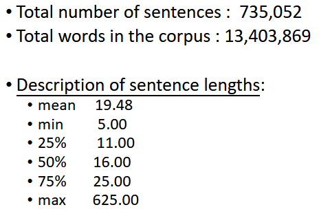
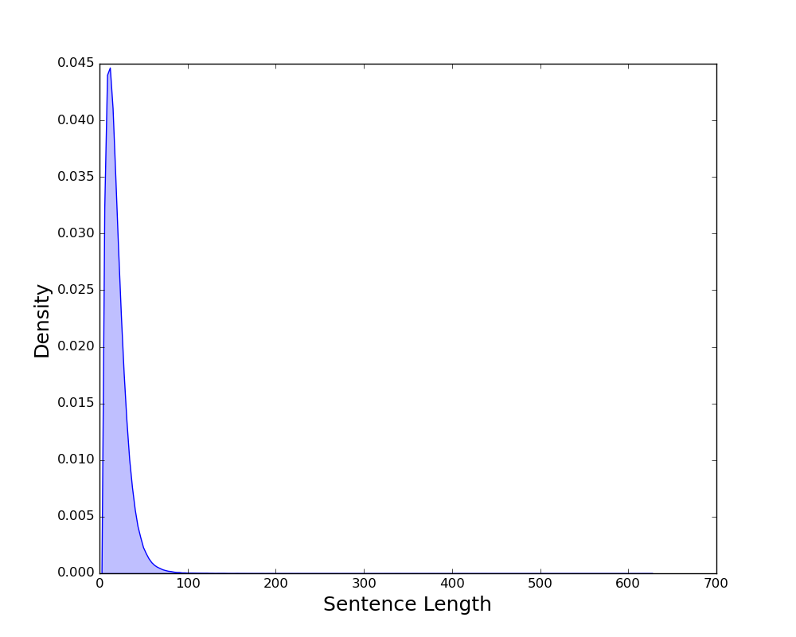

# Nepali National Corpus
The [Nepali National corpus (NNC)](https://www.sketchengine.eu/nepali-national-corpus/) is a Nepali corpus built up 13 million words that are lemmatised and part-of-speech tagged. The corpus consists of three different types of corpora: written corpus, parallel corpus and spoken corpus which is not part of the NNC corpus in Sketch Engine. The corpus was created within the NeLRaLEC project funded by Asia IT & C Programme of the European Commission. Corpus texts were PoS tagged and later lemmatised by Bal Krishna Bal from [Language Technology Kendra](http://ltk.org.np/) and Andrew Hardie from Lancaster University.

## Project Description
The parser is a derivative of [POS-Tagger_Nepali](https://github.com/raju-shrestha/POS-Tagger-Nepali/blob/master/ParseXMLCorpus.py).

### Structure.
The core file of the NNC corpus has been compressed to the file named [nn_updated_ah.zip](https://github.com/naamiinepal/POS-Tagger/blob/parse/nnc_updated_ah.zip).
After you extract the `zip` file using 
```
sudo apt-get install unzip
```
Then,
```
unzip nn_updated_ah.zip
```
you will find two directories: **cs** and **gs** with subdirectories as shown below.
```
└───nnc_updated_ah
    ├───cs
    └───gc
        ├───books
        ├───newspaper-journal
        └───webtext
            ├───m-1asphost-com-jhapalidotcom
            ├───nepali-cri-cn
            ├───www-bbc-co-uk-nepali
            ├───www-freenepal-com
            ├───www-gorkhapatra-org-np
            ├───www-janaprahar-com-np
            ├───www-kantipuronline-com
            ├───www-nepalicongress-org
            ├───www-nepalikalasahitya-com
            ├───www-nepalkoreanews-com
            ├───www-nepalnews-com-budhabaar
            ├───www-nepalnews-com-deshantar
            ├───www-nepalnews-com-dharana
            ├───www-nepalnews-com-drishti
            ├───www-nepalnews-com-gatibidhi
            ├───www-nepalnews-com-janastha
            ├───www-nepalnews-com-kamana
            ├───www-nepalnews-com-mahanagar
            ├───www-nepalnews-com-nispkshya
            ├───www-nepalnews-com-sadhana
            ├───www-newsofnepal-com
            ├───www-sahityasarita-org
            └───www-tanneri-com
```

All the leaves on this tree structre acquire `.xml` files that contains the required POS corpus.

## Objective
To parse the raw XML files from all the aforementioned directories into a dataframe containing the `list of words` in one column and their `POS tags` in the other.

## Run
To run the program, first extract `nnc_updated_ah.zip`.
Then run:
```
pip install -r requirements.txt
```

And, simply do:
```
python parse_XML.py -i ".\nnc_updated_ah\<directory_containing_xml_files>" -o ".\output_dir\<filename.gz>"
```
## Output
### Output File structure
The dataframe will have two columns - `words` and `tags`.
Each row represents a sentence/instance that is comprised of a list of constituent words and a list of their corresponding POS tags.

```
[word1, word2, ..., wordn]<comma>[tag1, tag2, ..., tagn]
```

### Output Directory
After parsing, the files will be stored in the directory [output_dir](https://github.com/naamiinepal/POS-Tagger/tree/parse/output_dir). 

### Ouptut File format
The output files are compressed DataFrames with extension `.gz` which can be loaded using `pandas.read_csv()` function.

#### Note:
- The contents of the DataFrame should be loaded in `utf-8` encoding.
- When you load the dataframe using `pandas.read_csv()` function, the data is rendered as Pandas Object rather than lists. To solve this, do:
```
import ast
df = pd.read_csv("file_name.gz", encoding = 'utf-8')

# Before.
print(type(df['words'].iloc[0]))  # String.

# After.
new_df = df['words'].apply(lambda x: ast.literal_eval(x))
print(type(new_df['words'].iloc[0]))  # List.
```

## Visualization of the sentence lengths

### Corpus Description


### Box Plot 


### KDE Plot 

